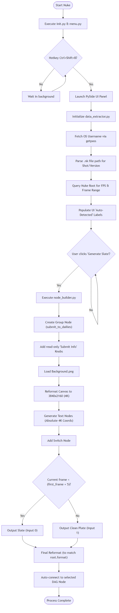

# Submit Slate Generator

A professional, resolution-independent Nuke tool that automates the generation of standardized slate cards for production review. It eliminates manual typographic setup by automatically extracting required data.

---

## Features

* **Zero-Touch Metadata Extraction**
  Automatically queries the OS environment for the artist's username, and cleanly parses the Nuke script's filepath to derive the project name, shot identifier, and version string.

* **Resolution-Independent Architecture**
  Constructs all text nodes natively against a 3840x2160 (4K UHD) canvas. A single, dynamically evaluated `Reformat` node guarantees that the resulting 1920x1080 background plate and all 4K text coordinates conform perfectly to your sequence's active root format without generating phantom Nuke resolutions.

* **Precision Frame Switching**
  Utilizes Nuke TCL (`frame < (first_frame + 5) ? 0 : 1`) to perfectly hold the slate for exactly 5 frames before seamlessly cutting to the clean sequence plate.

* **Floating Artist Interface**
  Employs PySide2/PySide6 (version-agnostic) to provide a non-blocking, always-on-top floating window. Artists can select their department and drop direct notes for their supervisors before generating the slate.

* **Data Persistence**
  The generated `submit_to_dailies` Group node automatically populates a custom "Submit Info" tab with all harvested metadata, ensuring properties persist reliably within the Nuke script.

---

## Installation

1. Place the `submit_screen` folder in your Nuke pipeline directory (e.g., `H:\Gamut\Projects\AntiGravity\submit_screen`).
2. Install the necessary Python dependencies:
   ```bash
   pip install -r REQUIREMENTS.txt
   ```
3. Open your user `.nuke/init.py` file (located in `~/.nuke/init.py` or `%USERPROFILE%\.nuke\init.py` on Windows).
4. Add the following command to point Nuke to the tool:
   ```python
   nuke.pluginAddPath(r"H:\Gamut\Projects\AntiGravity\submit_screen")
   ```
5. Restart Nuke.

---

## Usage

1. Launch Nuke.
2. Open the tool by pressing **Ctrl+Shift+B**, or navigate to **Nodes > Dailies Tools > Submit to Dailies**.
3. Select your **Dept** (Comp, Roto, Prep, etc.) and add any **Submission Notes**.
4. Click **Generate Slate**.
5. A `submit_to_dailies` Group node will be injected into your node graph. Connect this beneath your final Merge node before rendering.

---

## Architecture & Logic Flow



---

## Tech Stack

* Python 3
* Foundry Nuke API (`nuke` module)
* PySide2 / PySide6 (Qt UI Framework)
* Nuke TCL Expressions

---

## Architecture

```text
submit_screen/
├── init.py                      # Registers the plugin paths to Nuke
├── menu.py                      # Initializes the Nuke toolbar menu & hotkey bindings
├── README.md                    # This documentation file
├── REQUIREMENTS.txt             # Environment requirements (purely native PySide2/6)
└── src/
    ├── __init__.py              # Package identifier
    ├── constants.py             # Global constants: layout sizing, hex colors, frame durations
    ├── data_extractor.py        # Environment queries and string-parsing logic
    ├── node_builder.py          # The core Nuke Python API node construction and TCL logic
    ├── ui_panel.py              # Qt UI class definition and Nuke context-safe launch logic
    ├── media/
    │   └── Background.png       # The 1920x1080 slate background image template
    └── fonts/
        ├── Helvetica.ttf        # Bundled typography
        └── Helvetica-Bold.ttf   # Bundled typography
```

---

## Extensibility

This tool was designed for effortless pipeline extension:
* **Typography & Aesthetics**: Standardized hex constants (`0xCCCCCCFF`) and font registries are exclusively managed in `src/constants.py`.
* **Parsing Overrides**: If your studio's naming convention deviates, simply adjust the string `.split()` logic inside `src/data_extractor.py`.
