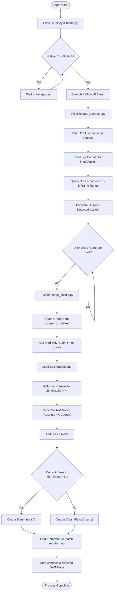

```mermaid
graph TD
    Start(["Start Nuke"]) --> Init["Execute init.py & menu.py"]
    Init --> Trigger{"Hotkey Ctrl+Shift+B?"}
    Trigger -- No --> Wait["Wait in background"]
    Wait --> Trigger
    Trigger -- Yes --> UI["Launch PySide UI Panel"]
    
    UI --> Extract["Initialize data_extractor.py"]
    Extract --> FetchOS["Fetch OS Username via getpass"]
    FetchOS --> ParseScript["Parse .nk file path for Shot/Version"]
    ParseScript --> QueryRoot["Query Nuke Root for FPS & Frame Range"]
    
    QueryRoot --> UIRefresh["Populate UI 'Auto-Detected' Labels"]
    
    UIRefresh --> UserInput{"User clicks 'Generate Slate'?"}
    UserInput -- No --> UserInput
    UserInput -- Yes --> NodeBuilder["Execute node_builder.py"]
    
    NodeBuilder --> GroupNode["Create Group Node (submit_to_dailies)"]
    GroupNode --> AddKnobs["Add read-only 'Submit Info' Knobs"]
    AddKnobs --> Background["Load Background.png"]
    Background --> CanvasReformat["Reformat Canvas to 3840x2160 (4K)"]
    
    CanvasReformat --> TextStack["Generate Text Nodes (Absolute 4K Coords)"]
    TextStack --> SwitchNode["Add Switch Node"]
    SwitchNode --> SwitchLogic{"Current frame < (first_frame + 5)?"}
    
    SwitchLogic -- Yes --> ShowSlate["Output Slate (Input 0)"]
    SwitchLogic -- No --> ShowPlate["Output Clean Plate (Input 1)"]
    
    ShowSlate --> FinalFormat["Final Reformat (to match root.format)"]
    ShowPlate --> FinalFormat
    
    FinalFormat --> Connect["Auto-connect to selected DAG Node"]
    Connect --> End(["Process Complete"])
```
